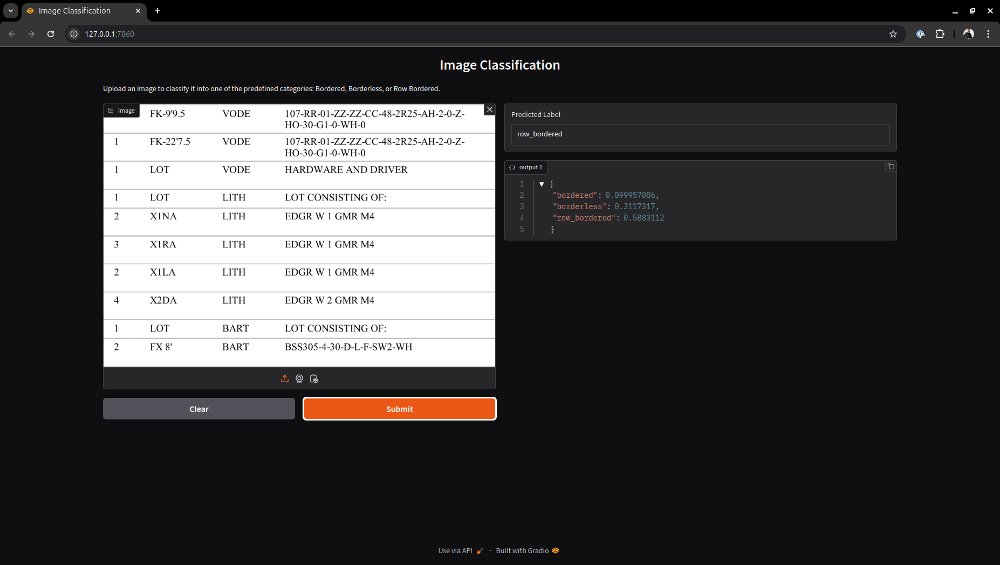

# Image Classification

This project is a deep learning image classification task using TensorFlow and Keras. It includes training a CNN on a custom image dataset.

# Live hosted [LINK](https://huggingface.co/spaces/ashuguptahere/parspec-assignment-gradio)

## 📥 Installation:

### 1. Clone the project and change the directory:

```
git clone https://github.com/ashuguptahere/parspec-assignment.git
cd parspec-assignment
```

### 2. Install [uv](https://docs.astral.sh/uv/getting-started/installation/) for Linux:
```
curl -LsSf https://astral.sh/uv/install.sh | sh
```

### 3. To install all the requirements:
```
uv sync
```

### 4. Download and extract `dataset.zip` file:
```
gdown "https://drive.google.com/uc?id=1KQebmd59f_PT1taK0EsJF5DCSMcqxNYX"
unzip dataset.zip
```

### 5. To run preprocessing, training and testing check below file:
```
image_classification.ipynb
```

### 6. To start `gradio` app:

```
gradio app.py
```

## Results:




## 🤝 Contributing:

Contributions are welcome! Please feel free to submit a Pull Request.

1. Fork the project
2. Create your feature branch (`git checkout -b feature/AmazingFeature`)
3. Commit your changes (`git commit -m 'Add some AmazingFeature'`)
4. Push to the branch (`git push origin feature/AmazingFeature`)
5. Open a Pull Request

## 📝 License:

This project is licensed under the MIT License - see the [LICENSE](LICENSE) file for details.

---
Made by [Aashish Gupta](https://github.com/ashuguptahere)